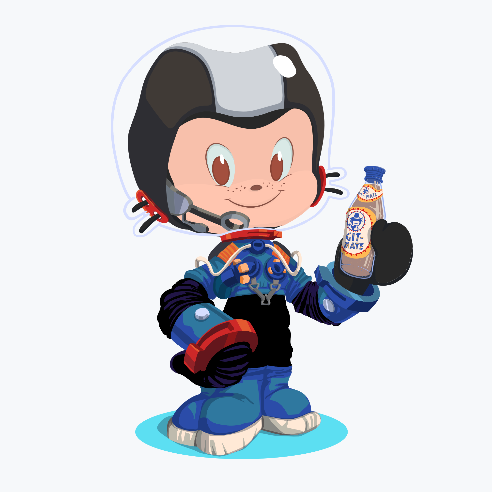

### Greeting Fellow Humans! 🖖

<!--
eneax/eneax is a ✨special ✨ repository that you can use to add a README.md to your GitHub profile.
Make sure it’s public and initialize it with a README to get started.
-->
